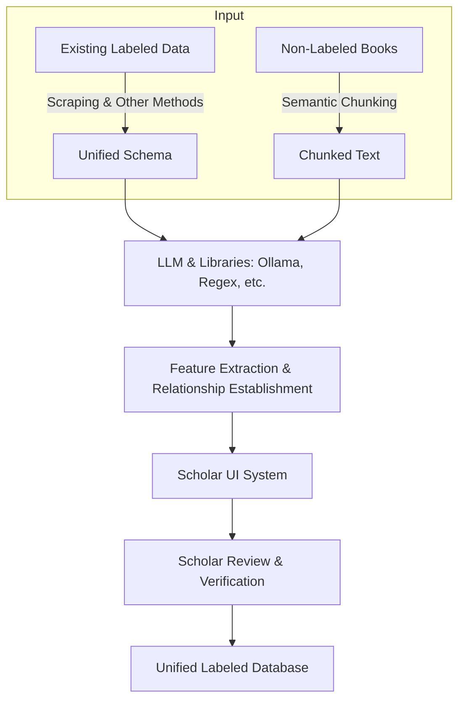

* There are many ways to structure data in text. 
* At its core, structuring is usually done by experts and scholars. 
* Even when using other methods, scholars must review the results. 
* Example: 
    * Given the sentence **"Mohamed is born in Makkah"**:
    * Who can confirm if "Mohamed" refers to the Prophet or someone else? 
    * If the name repeats, is it the same person or a different one? 

* Experts are needed to verify identities and gather accurate information. 
* Our current approach: 
    * Scrape data from HTML sources where text and books are labeled correctly. 
    * Collect information from multiple sources that have already been verified. 
* Downsides of this approach: 
    * Each source has its own annotation system, with strengths and weaknesses. 
    * Sources often do not explain their labeling methods. 
    * Reviewers and validators are usually not clearly mentioned. 
    * Data is often incomplete.

* Additional challenges: 
    * Many books and large amounts of information are still not labeled. 
    * Our biggest challenge is unifying all data into one database. 
    * We must remove duplicate information across sources. 
    * We must allow conflicting information to exist, clearly mentioning the source for each. 

* New technologies and solutions: 
    * Models like **Ollama**, **regex**, and other libraries can extract features and understand text to some extent. 
    * We can use these tools, but mistakes will happen. 
    * It's hard to integrate newly labeled books with the existing labeled database. 

* Our proposed system: 
    * Use LLMs (like Ollama) and libraries to extract features and establish relationships between them. 
    * Provide a **UI system** for scholars to: 
        * Correct, verify, and approve the extracted data. 
        * Connect verified data to our labeled database. 

* To achieve this, we must: 
    * **Collect all existing labeled data** into one database through scraping and other methods, following a **unified schema**. 
    * **Prepare non-labeled books** by applying **semantic chunking**, making them ready for scholar review in the UI system.

## in case of chunking , we have some book sources
* Some book sources label content with **chapters, sub-chapters, headers, and sub-headers**. 
* Each **header** contains multiple **paragraphs**. 
* We can use **paragraphs** as **semantic chunks** for processing.

